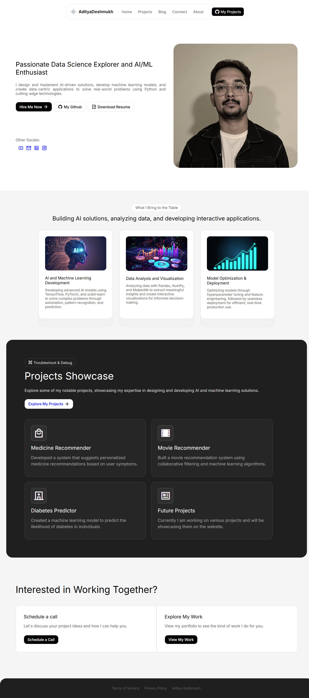

# 🚀 Aditya Deshmukh's Portfolio Website

Welcome to my personal portfolio website! This is where I showcase my projects, skills, experience, and more. The site is designed to give potential employers, collaborators, and curious minds an insight into my work and passion for data science, AI, and full-stack development.

## 🌐 Live Website

[Visit Portfolio](https://your-portfolio-link.com)

## 📸 Preview

 <!-- Replace with an actual image or remove -->

## 📁 Features

- ✨ Responsive Design (Mobile & Desktop)
- 📊 Project Showcase with Live Demo & GitHub Links
- 👨‍💻 About Me Section
- 🛠️ Skills Overview
- 📄 Resume Download
- 📬 Contact Form

## 🛠️ Built With

- **Frontend**: HTML5, CSS3, JavaScript  
- **Styling**: Tailwind CSS / Bootstrap / SCSS *(choose what applies)*
- **Deployment**: GitHub Pages / Vercel / Netlify *(mention your choice)*

Thank You
